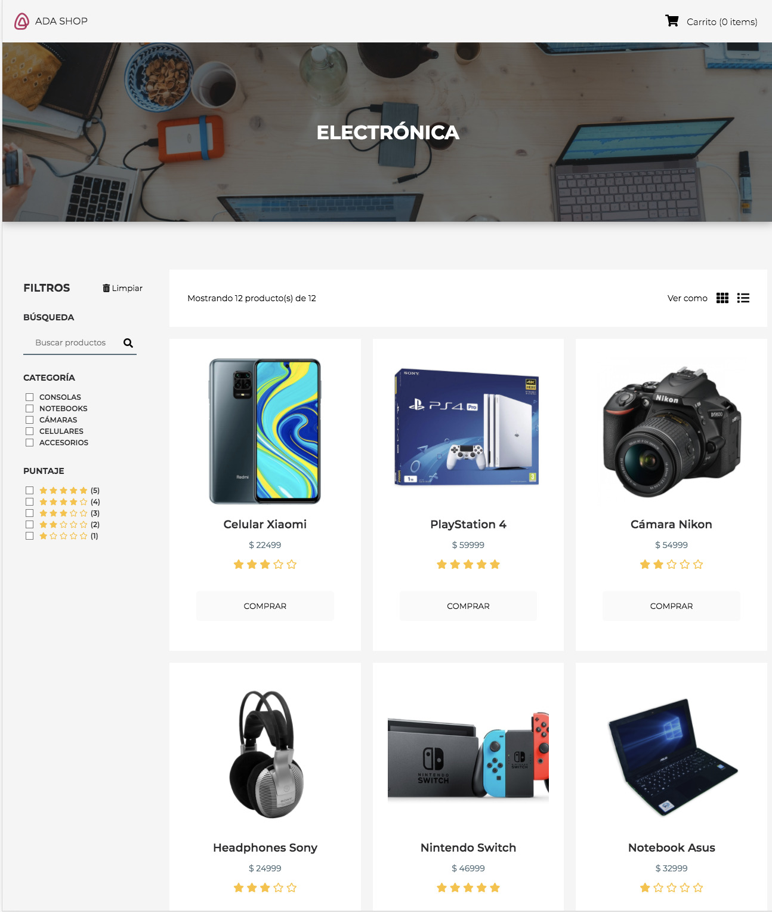

# Proyecto: Tienda 🛍

## Bienvenidos! 👋

Proyecto de tienda de comercio electronico, que debe ser un sitio responsivo, accesible e interactivo para que pueda ser visitado desde cualquier dispositivo. Las herramientas que se ultilizaran para modificar el contenido seran HTML, CSS y JavaScript, que permiten incorporar efectos y transiciones para volver mas atractivo y ofrecer un mejor feedback visual, confuncionalidades que permitan manipular la lista de productos y el carrito de compras.

### Ejemplo ▶️▶️▶️

[PROYECTO ADA-SHOP](https://frontend-proyecto-tienda.adaitw.org/)

## Contenido

- Filtros y busqueda.
  - mostrar productos con un input segun el nombre.
  - la lista de productos se actualiza.
  - la busqueda ignora mayusculas y minusculas.
- Carrito de compra.

  - agrega y elimina un producto al carrito.
  - cuando se encuentre vacio, el carrito lo indicara.
  - muestra la cantidad de productos agregados en total.

- Checkout.
  - pide nombre y email.
  - pide seleccionar metodo de pago.
  - tiene la opcion de envio.
  - pregunta si tiene el usuario tarjeta de descuento.
  - muestra el resumen de la compra.
- Accesibilidad.
